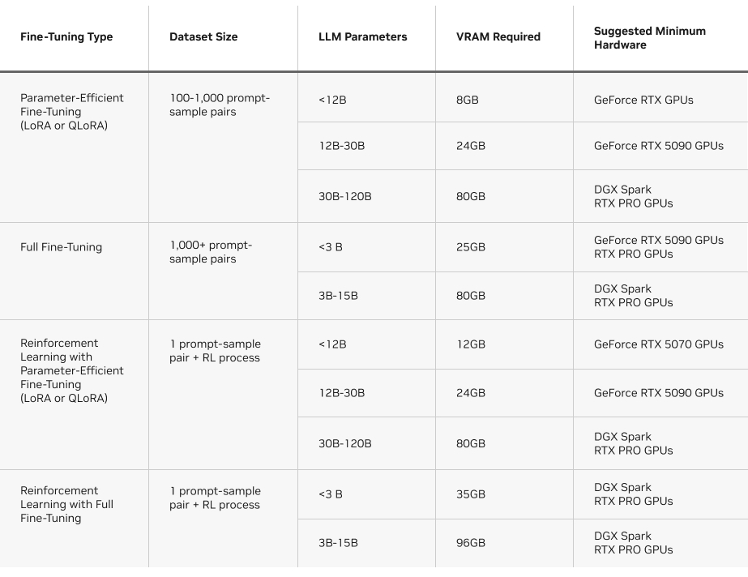

# Train and evaluate a customised LLMs
## Use cases

> This repo is an automated, easy-to-customize end-to-end LLMs post-training pipeline that consists of : 
* Data generation and pre-processing,
* Model fine-tuning,
* Model evaluation (via <a href="https://github.com/huggingface/lighteval">LightEval</a> library by <a href="https://huggingface.co/">HugginFace</a>), 
* Model inference and serving (<a href="https://github.com/vllm-project/vllm">vLLM</a> and <a href="https://github.com/open-webui/open-webui">Open-WebUI</a> via <a href="https://github.com/docker">Docker</a>  ).  
> The pipeline configurations are stored in a YAML (<a href="configs/default_config.yaml">configs/default_config.yaml </a>) file for easily change of models (i.e., gpt-oss, Qwen, DeepSeek,Gemma LLaMA), dataset, training, and evaluation hyperparameters.


## Getting started
After cloning this repo, install dependencies
```yaml
# 1. Clone repository 
git clone https://github.com/Tohokantche/custom-llm.git
cd custom-llm

# 2. Install requirements
pip install -r requirements.txt
```

Generate data, train and evaluate your LLMs model with the default configuration
```yaml
# Train on 1 GPU using the default shell script (for linux environment)
chmod +x run_train.sh
./run_training.sh

# Train on multiple GPUs using the default shell script (for linux environment)
chmod +x run_distributed_train.sh
./run_distributed_training.sh

# Train on 1 GPU using the Python script and your configuration file (for windows and linux environment)
python scripts/main.py  --config configs/default_config.yaml

# Train on multiple GPUs (i.e., 5) using the Python script and your configuration (for windows and linux environment)
torchrun --nproc_per_node 5 scripts/main.py  --config configs/default_config.yaml
```

Deployment and inference using Docker
```yaml
# Deploy your trained LLM using vLLM as inference engine and open-webui for the user interface
cd configs && docker-compose up -d

```
## GPU memory requirement for efficient fine-tuning of any open-source LLMs



## Acknowledgments 

This repo is inspired by <a href="https://huggingface.co/">HugginFace</a> and  <a href="https://github.com/unslothai/unsloth">Unsloth AI</a>. They are doing an amazing job for efficient LLMs post-training. Make sure to check them out and buy them a coffee!

## License

This project is licensed under the Apache 2.0 License – see the [LICENSE](LICENSE) file for details. You are free to use, modify, and distribute it in either commercial or academic projects under the terms of this license.


