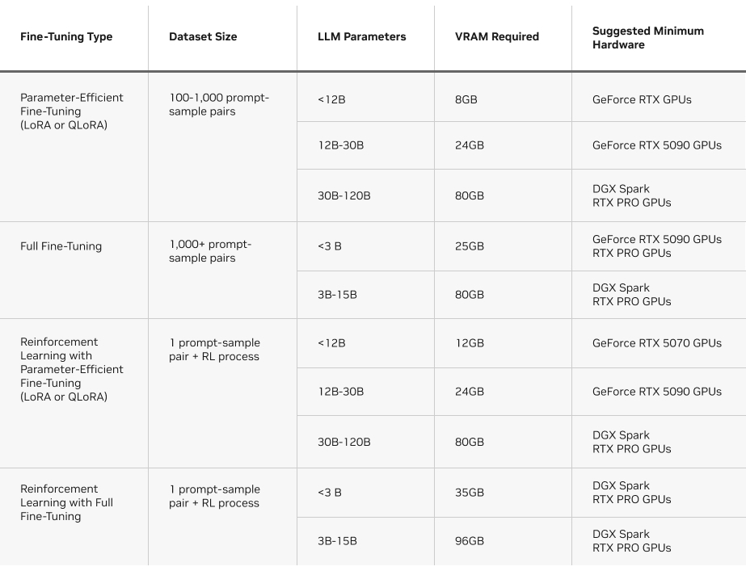

# Efficiently train, evaluate and serve a customised LLM
## Use cases

> This repo is an automated, easy-to-customize and end-to-end LLMs post-training pipeline that consists of the following components : 
* :white_check_mark: Data generation and pre-processing (<a href="https://github.com/meta-llama/synthetic-data-kit">Synthetic Data Kit</a>),
* :white_check_mark: Model fine-tuning (<a href="https://huggingface.co/docs/trl/en/index">TRL</a>),
* :white_check_mark: Training logging and monitoring (<a href="https://wandb.ai/site/">Weight & Bias</a>),
* :white_check_mark: Model evaluation (<a href="https://github.com/huggingface/lighteval">LightEval</a> of <a href="https://huggingface.co/">HugginFace</a>), 
* :white_check_mark: Model inference and serving (<a href="https://github.com/vllm-project/vllm">vLLM</a> and <a href="https://github.com/open-webui/open-webui">Open-WebUI</a> using <a href="https://github.com/docker">Docker</a>).
  

> Pipeline configurations are stored in a YAML file (<a href="configs/default_config.yaml">configs/default_config.yaml </a>) to enable easy hyperparameter tuning, model changes (i.e., gpt-oss, Qwen, DeepSeek, Gemma, LLaMA ...), and data source updates.


## Getting started
After cloning this repo, install dependencies on a machine with Nvidia-GPU
```yaml
# 1. Clone repository 
git clone https://github.com/Tohokantche/custom-llm.git
cd custom-llm

# 2. Create and activate a virtual environment
python -m venv .venv
source .venv/bin/activate  # On Windows, use `.venv\Scripts\activate`

# 3. Install requirements
pip install -r requirements.txt
```

Standalone data generation and filtering pipeline
```yaml
# Data generation 
python scripts/generate_data.py  --config configs/default_config.yaml
```

Standalone model training pipeline
```yaml
# Model training
python scripts/train_model.py  --config configs/default_config.yaml
```

Standalone model evaluation pipeline
```yaml
# Model evaluation
python scripts/evaluate_model.py  --config configs/default_config.yaml
```

End-to-end data generation, model (LLMs) training and evaluation with the default configuration
```yaml
# End-to-end training on 1 GPU using the default shell script (for linux environment)
chmod +x run_train.sh
./run_training.sh

# End-to-end training on multiple GPUs using the default shell script (for linux environment)
chmod +x run_distributed_train.sh
./run_distributed_training.sh

# End-to-end training on 1 GPU using the Python script and your configuration file (for windows and linux environment)
python scripts/e2e_training.py  --config configs/default_config.yaml

# End-to-end training on multiple GPUs (i.e., 5) using the Python script and your configuration (for windows and linux environment)
torchrun --nproc_per_node 5 scripts/e2e_training.py  --config configs/default_config.yaml
```

Deployment and inference of your trained LLM using <a href="https://docs.docker.com/desktop/">Docker</a>
```yaml
# Deploy your trained LLM using vLLM as inference engine and open-webui for the user interface
cd configs && docker-compose up -d
```

## <a href="https://huggingface.co/Tohokantche">Demo</a> of the generated data and trained models 
Please visit this link for an exemple of generated and curated data, and trained model:
```yaml
# Generated data
https://huggingface.co/Tohokantche/datasets

# Trained models (in vLLM, GGUF, and lora adapters format)
https://huggingface.co/Tohokantche/models
```

## Nvidia-GPU memory and data requirement for an efficient training


## File structure
```text
custom-llm
├── configs
│   ├── default_config.yaml                 # Configuration file 
│   ├── docker-compose.yml                  # VLLM inference of the trained model via Docker
│   └── synthetic_data_kit_config.yaml.     # Synthetic data generation configuration file
├── LICENSE
├── README.md                               # Documentation
├── requirements.txt                        # Reauirements file to install project dependencies
├── run_distributed_training.sh             # Distributed training script
├── run_training.sh                         # Single GPU training script 
├── scripts
│   ├── e2e_training.py                     # End-to-end, data generation, training and evaluation script
│   ├── evaluate_model.py                   # Standalone Model perfromance evaluation script 
│   ├── generate_data.py                    # Standalone Synthetic data generation script
│   └── train_model.py                      # Standalone Model training  script
└── src
    ├── __init__.py
    ├── assets
    │   └── Fine-tuning-requirements-on-Unsloth.jpg
    ├── checkpoints                          # Saved models directory
    ├── data
    │   ├── __init__.py                     
    │   ├── dataloader.py                    # Data processing and filtering pipeline
    │   └── dataset.py                       # Data generation pipeline
    ├── evals
    │   ├── __init__.py
    │   ├── evaluate.py                      # Model evaluation pipeline
    │   ├── if_eval.py                       # Instructions Following evaluation pipeline
    │   ├── mmlu_eval.py                     # Language Understanding evaluation pipeline
    │   ├── toxicity_eval.py                 # Toxicity evaluation pipeline
    │   └── truthful_eval.py                 # Truthfulness evaluation pipeline
    ├── logs                                 # Training logs directory
    ├── models
    │   ├── __init__.py
    │   └── models.py                        # Model loading and instantianciation
    ├── notebooks
    │   └── Simple_Inference.ipynb           # Notebook to test model on a single prompt
    ├── tasks
    │   ├── __init__.py
    │   └── tasks_template.py                # Custom evaluation tasks template
    ├── train.py                             # Training models
    └── utils
        ├── __init__.py
        ├── helpers.py                       # Helpers funtions
        └── metrics.py                       # Custom evaluation metric template for tasks
```


## Acknowledgments 

This repo is inspired by <a href="https://huggingface.co/">HugginFace</a> and  <a href="https://github.com/unslothai/unsloth">Unsloth AI</a>. They are doing amazing jobs for an efficient LLMs post-training. Make sure to check them out and buy them a coffee!

## License

This project is licensed under the MIT License – see the [LICENSE](LICENSE) file for details. You are free to use, modify, and distribute it in either commercial or academic projects under the terms of this license.


